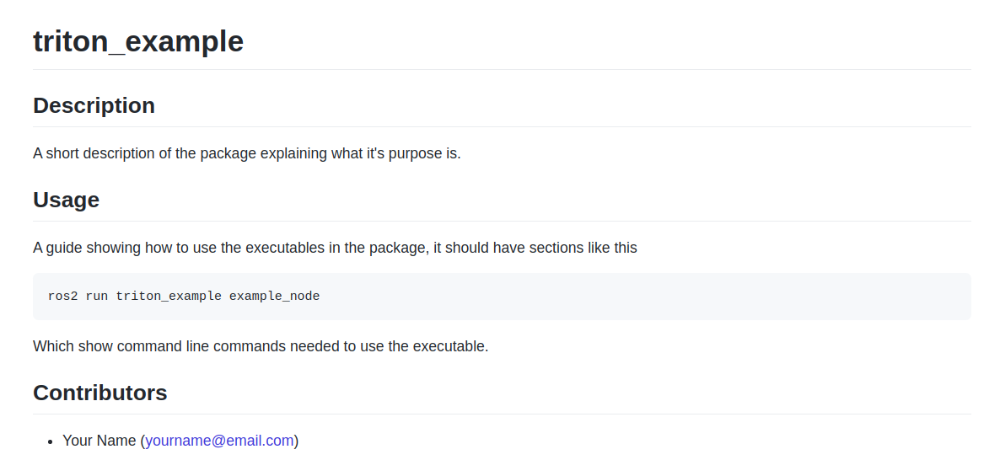

# Conventions
To make it easier for the members of the team to understand each other's contributions to this repo, and to create a cohesive codebase, we have put in place the following conventions which are expected to be followed when developing on this repo.

# Contents
- [Programming](programming)
    - [Python Conventions](python-conventions)
    - [C++ Conventions](c++-conventions)
- [ROS2](ROS2)
- [GitHub](GitHub)

# Programming

## Python Conventions

For the python programming conventions we use, they loosely follow the [PEP](https://www.python.org/dev/peps/pep-0008/) guidelines. The following list gives the conventions that should be followed

- Module names are **under_scored**
- Class names are **CamelCase**
- Constant names are **UPPER_UNDER_SCORED**
- Function names are **under_scored**
- Functions that are "helper" or "private" should be **_prefix_under_scored**
- All "helper" or "private" functions should be put below regular functions
- Arguments and variables are **under_scored**
- Leave **2** lines between functions and classes
- Imports should be organized **Standard, Third-Party, Application**
- Functions should be documented as per [**Epytext**](http://epydoc.sourceforge.net/epytext.html)

Here is an example python module displaying these conventions
```
# example_module.py
import some_standard_library
import another_standard_library

from some_third_party_library import ExtendedClass

import some_application_library
import another_application_library


class ExampleClass(ExtendedClass):
    """
    Optional class description
    """


    def __init__(self, arg_one, arg_two):
        """
        Short Explanation

        Longer explanation where you describe more in depth
        the purpose that this function has

        @param arg_one: A description of arg_one
        @param arg_two: A description of arg_two

        """
        self._helper_function(arg_one)
        self.member_var = arg_two


    def member_function(self, arg_one):
        """
        Short Explanation

        Longer explanation where you describe more in depth
        the purpose that this function has

        @param arg_one: A description of arg_one
        @type: An optional description of arg_one's type
        @return: Description of return value

        """
        local_var = 1
        return some_application_library.special_function(arg_one, local_var)

    
    def _helper_function(self, arg_one):
        """
        Short Explanation

        Longer explanation where you describe more in depth
        the purpose that this function has

        @param arg_one: A description of arg_one
        @type: An optional description of arg_one's type
        @return: Description of return value
        """
        arg_one += 5
        return arg_one


class AnotherExampleClass:


    def __init__(self, arg_one):
        """
        Short Explanation

        Longer explanation where you describe more in depth
        the purpose that this function has

        @param arg_one: A description of arg_one
        """
        self.member_var = arg_one


"""
Description of main program
"""
def main():
    example_class_obj = ExampleClass(1, 2)
    example_class_obj.member_function(3)


```

## C++ Conventions
The C++ programming conventions we use are loosely based off the [ROS C++ Style Guide](http://wiki.ros.org/CppStyleGuide). When creating a `.cpp` file, you must also have a `.hpp` file with the same name. The following list gives the conventions that should be followed
- File names are **under_scored**
- Class names should be **CamelCase**
- Constant names are **UPPER_UNDER_SCORED**
- Functions should be **lowerCamelCase**
- Arguments are **under_scored**
- Local variables are **under_scored**
- Member variables are **under_scored_suffix_**
- Members should be organized **Functions, Constants, Variables**
- Leave **2** lines between functions and classes
- If the C++ file exists in `triton_<PACKAGE_NAME>`, then the classes/functions should be namespaced using **<PACKAGE_NAME>**. 
- If the file `example_file.hpp` exists in `triton_<PACKAGE_NAME>`, it's should have a definition **TRITON_<PACKAGE_NAME>__EXAMPLE_FILE**
- Includes should be organized **Standard, Third-Party, Application**
- Includes should be in the `.hpp` as much as possible
- Brackets (ie. `{` and `}`) should start on a new line
- Function should be commented as per [Doxygen C++](https://www.doxygen.nl/manual/docblocks.html)

Here is an example `.hpp` and `.cpp` file in the package `triton_example` dispalying these conventions

```
// example_file.hpp
#ifndef TRITON_EXAMPLE__EXAMPLE_FILE
#define TRITON_EXAMPLE__EXAMPLE_FILE

#include <some_standard_library>
#include <another_standard_library>

#include <some_third_party_library>

#include <some_application_library>
#include <another_application_library>


namespace example 
{


    class ExampleClass: public some_third_party_library::ExtendedClass
    {
        public:


            /** Short Explanation
             *
             * Longer explanation where you describe more in depth
             * the purpose that this function has
             *
             * @param arg_one A description of arg_one
             */
            ExampleClass(double arg_one);


            /** Short Explanation
             *
             * Longer explanation where you describe more in depth
             * the purpose that this function has
             *
             * @param arg_one A description of arg_one
             * @param arg_two A description of arg_two
             * @return Description of return value
             */
            int publicFunction(int arg_one, bool arg_two);


        private:            


            /** Short Explanation
             *
             * Longer explanation where you describe more in depth
             * the purpose that this function has
             *
             * @param arg_one A description of arg_one
             * @param arg_two A description of arg_two
             * @return Description of return value
             */
            int privateFunction(int arg_one, bool arg_two);


            const int CONSTANT_VALUE = 1;

            int member_variable_int_;
            bool member_variable_bool_;
    };


} // namespace example

#endif  //TRITON_EXAMPLE__EXAMPLE_FILE
```

```
// example_file.cpp
#include "triton_example/example_file.hpp"

namespace example
{


    ExampleClass::ExampleClass(int arg_one)
    {
        member_variable_int_ = this->privateFunction(arg_one, true);
    }


    int ExampleClass::publicFunction(int arg_one, bool arg_two)
    {
        int local_var = arg_one;
        if (arg_two)
        {
            local_var += arg_one;
        }
        return local_var;
    }


    int ExampleClass::privateFunction(int arg_one)
    {
        member_variable_bool_ = false;
    }


} // namespace example
```

# ROS2
ROS2 has it's own set of conventions which we will follow. The following list gives the conventions that should be followed
- Packages should be named **triton_<PACKAGE_NAME>** where `<PACKAGE_NAME>` is short and descriptive of the packages purpose (e.g `triton_example`)
- Namespaces should be **under_scored** and as short as possible (e.g `/ns/component_one/output`)
- Topics, actions, services, and node_names should also be **under_scored**
- All interface files (`.msg`,`.srv`,`.action`) should be **CamelCase** (e.g `CustomMessage.msg`)
- Launch files should end in `_launch.py` (e.g `example_node_launch.py`)

# GitHub
There are a few conventions we have in place to keep our version control system cohesive. The following list gives the conventions that should be followed
- When naming a branch to work on a given issue, name the branch **<YOUR_NAME>/issueN**  where `<YOUR_NAME>` is your name and `N` is the issue number (e.g `logan/issue19`)
- Each package should have documentation in a `README.md` file. When documenting a package, you need at least 3 sections; Description, Usage, and Contributors, as shown below 

 

Make sure to always put yourself as a contributor to the package if you contribute a non-trivial amount to the package. You can have other sections (e.g Nodes, Models, Images) which further document the package. See current packages in the repo to see examples of common sections which are added.


