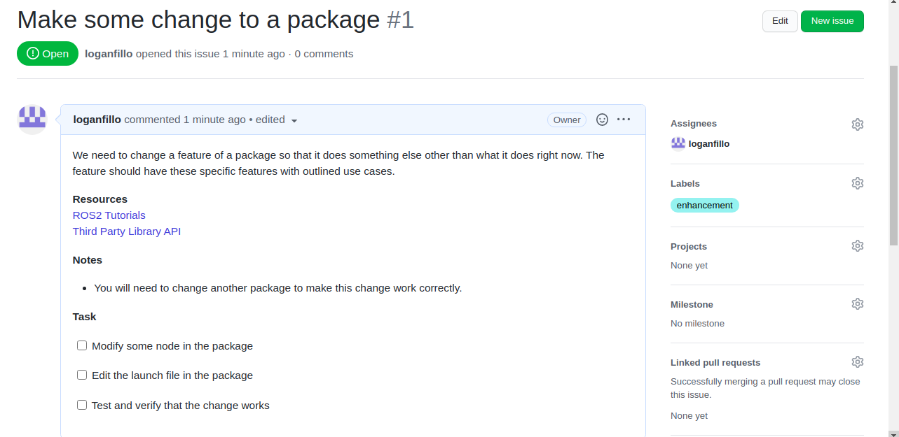
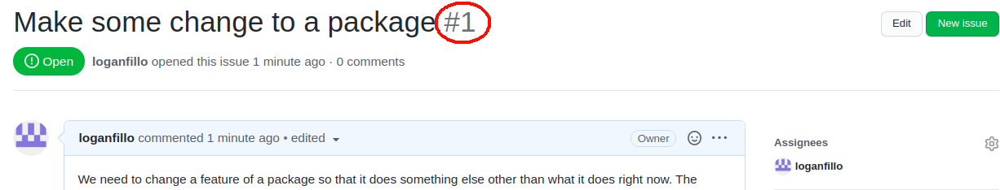
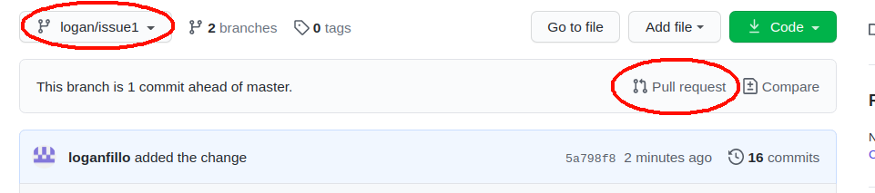
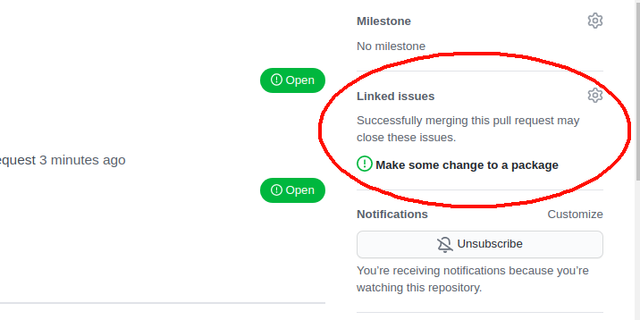
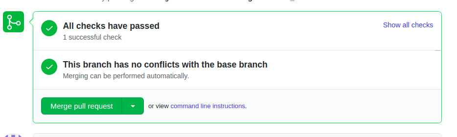

# Workflow
This document outlines the workflow that one should follow when developing on this repo.

 First, you will have been assigned to a GitHub issue associated to the `triton` repo that will look something like this 

 

 This issue will generally have the following sections, a section describing the reason for the issue and what should be done to resolve it, a set of resources that might come in handy, a set of notes that should be taken into consideration when developing, and a set of tasks which break the issue up into smaller components. These tasks are meant to guide you through the issue, but are not concrete and are simply there to help keep you on track. Feel free to add to or modify the tasks as you see fit. To start working on the issue, you must branch off from the latest state of the `master` branch of `triton` as such **(*NOTE*: In some cases, you will be branching off of someone else's branch, keep track of if you do this and let a team lead know before submitting a pull request as you will have to merge with the other branch before `master` as shown later on)**

    cd <PATH_TO_TRITON>/triton
    git checkout master
    git pull
    git checkout -b <YOUR_FIRST_NAME>/issue<N>

Note that `<PATH_TO_TRITON>` should be substituted to what it is on your machine,  `<YOUR_FIRST_NAME>` should be substituted as your first name, and `<N>` should be the number of the issue you were assigned, outlined in red here 

Therefore, the name I would call my branch would be `logan/issue1`. To update the state of your branch, follow the basic add, commit, and push workflow in git. [Here](https://www.earthdatascience.org/workshops/intro-version-control-git/basic-git-commands/#tracking-changes-with-git-add-and-git-commit) is a tutorial on that if you are new to git. Once you are have completed the tasks given in the issue, and are sure that it follows the [conventions](CONVENTIONS.md) (make sure you add/edit any package documentation as stated [here](CONVENTIONS.md#github)) you are asked to follow, it is time to make a pull request. Go to the `triton` repo on GitHub, make sure you are viewing the branch which you are trying to make a pull request for, and you should see a button which says "Pull request"

Make sure that you link the pull request to the corresponding issue using the lower right bar as shown below

Once filling out this pull request, you will then wait for it to be approved. The approver might ask you to make some changes to your branch, or you might have to change something if the build and test checks do not pass when you open the pull request. Note that the pull request will update as you push to your branch. If all the checks are passing, you should see something like this at the bottom of your pull request 

Once all checks are passing and the pull request is accepted, it will be merged into the `master` branch. After it has been merged and you are assigned a new issue, proceed with the same process as given above. Make sure that you **DON'T** branch off of your last issue's branch and that you checkout and pull from master before branching off for your next issue. 