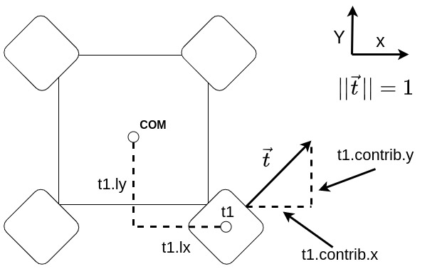

# triton_controls
## Description

This package contains the nodes related to the control system. 

## Usage

To launch the `thrust_allocator` node, use the following command

    ros2 launch triton_controls thrust_allocator_launch.py

You can change the configuration file for the `thrust_allocator` in the launch file, just be sure that the configuration file you want to use exists in `triton_controls/config`.

### Robot Localization
To run the robot localization node, which estimates the pose, twist, and acceleration of the AUV, run

        ros2 launch triton_controls state_estimator_launch.py

### Waypoint Marker
To run the waypoint marker node, run

        ros2 launch triton_controls waypoint_marker_launch.py

### Trajectory Generator
To run the Trajectory Generator node, run 

        ros2 launch triton_controls trajectory_generator_launch.py

## Nodes

- `thrust_allocator` : A standalone node which subscribes to the desired forces and torques to act upon the AUV and publishes an array which contains the allocated forces and associated PWM signals given to each thruster based on the config file passed in on launch

    ### Subscribed Topics
    - `controls/input_forces` (`geometry_msgs/msg/Wrench.msg`) : Input forces and torques
    ### Published Topics
    - `controls/output_forces` (`std_msgs/msg/Float64MultiArray.msg`) : Forces corresponding to each thruster
    - `controls/signals` (`std_msgs/msg/Float64MultiArray.msg`): PWM signals corresponding to each thruster
    ### Parameters 
    - `num_thrusters` (`int32`): The number of thrusters in the configuration
    - `ti.contrib.x` (`float32`): The x-axis contribution of thruster `i`
    - `ti.contrib.y` (`float32`): The y-axis contribution of thruster `i`
    - `ti.contrib.z` (`float32`): The z-axis contribution of thruster `i`
    - `ti.lx` (`float32`): The x-length of thruster `i` from the AUV's centre of mass
    - `ti.ly` (`float32`): The y-length of thruster `i` from the AUV's centre of mass
    - `ti.lz` (`float32`): The z-length of thruster `i` from the AUV's centre of mass
    ### Notes
    - In the config file, you MUST define the thrusters `t1,...,tn` in the config file where `n = num_thrusters`. See the config file for examples of this configuration
    - You can currently only configure up to **6** thrusters.
    - In the `config.yaml`, the root key must be the full name of the node being configured
    - Here is a diagram showing how to parameterize a thruster (assume it's in the `z = 0` plane of the centre of mass)
      
    Be aware that in this example `t1.ly` would be negative, `t1.lx` would be positive, and `t1.contrib.x`, `t1.contrib.y` would both also be positive.

- `state_estimator` : A standalone node which subscribes to the IMU and sound localization position topics, and publishes an estimated state of the AUV, including position, velocity, and acceleration. 

    ### Subscribed Topics
    - `drivers/imu/out` (`sensor_msgs/Imu`) : IMU data: linear acceleration and angular velocity
    - `state` (`geometry_msgs/PoseWithCovarianceStamped`) : Position. This topic name will likely be updated. 
    ### Published Topics
    - `controls/ukf/odometry/filtered` (`nav_msgs/Odometry`) : AUV state
    ### Notes
    - This node is configured with the config file `state_estimator_config.yaml`.

- `waypoint_marker` : A standalone node that monitors whether a set waypoint has been achieved, and publishes waypoint information and error to target. 

    ### Subscribed Topics
    - `controls/ukf/odometry/filtered` (`nav_msgs/Odometry`) : AUV state
    - `controls/waypoint_marker/set` (`triton_interfaces/Waypoint`) : Target waypoint
    ### Published Topics
    - `controls/waypoint_marker/current_goal` (`triton_interfaces/Waypoint`) : Current target waypoint
    - `controls/input_pose` (`geometry_msgs/Pose`) : Error to target pose. For navigation. 
    ### Notes
    - Initially, no goal is set. 
    - When a goal is set, the waypoint marker continuously monitors AUV state to determine whether the goal is achieved
        - If a goal is set, attempts to set the same goal is ignored
        - After a goal is achieved, it returns to the 'no goal' state
        - Success is determined by the 'current_goal' topic, in the 'success' field of the waypoint messages
    - When no goal is set, Poses with all zeros are published to the 'input_pose' topic, indicating that the AUV should not move

- `trajectory_generator` : A standalone node that generates a set of waypoints based on current pose, destination pose, and trajectory type. 

    ### Subscribed Topics
    - `controls/ukf/odometry/filtered` (`nav_msgs/Odometry`) : AUV state
    - `controls/waypoint_marker/current_goal` (`triton_interfaces/Waypoint`) : Current target waypoint
    - `controls/trajectory_generator/set` (`triton_interfaces/ObjectOffset`) : Current destination and object type
    - `controls/trajectory_generator/set_type` (`triton_interfaces/TrajectoryType`) : Current trajectory type
    ### Published Topics
    - `controls/waypoint_marker/set` (`triton_interfaces/Waypoint`) : Set current target waypoint
    ### Notes
    - Initially, trajectory type is 'START'. It publishes a waypoint that is always +0.5 rad in yaw of the current pose, causing the AUV to turn around slowly. 
    - Other nodes (e.g. the Mission Planner) decide when to start the next stage, and change trajectory type to 'GATE'
    - When trajectory type is 'GATE', the trajectory generator sets the gate pose to be the destination pose
        - TODO: make an actual trajectory

## Contributors

- Logan Fillo (logan.fillo@gmail.com)
- Jared Chan (jaredchan42@gmail.com)
